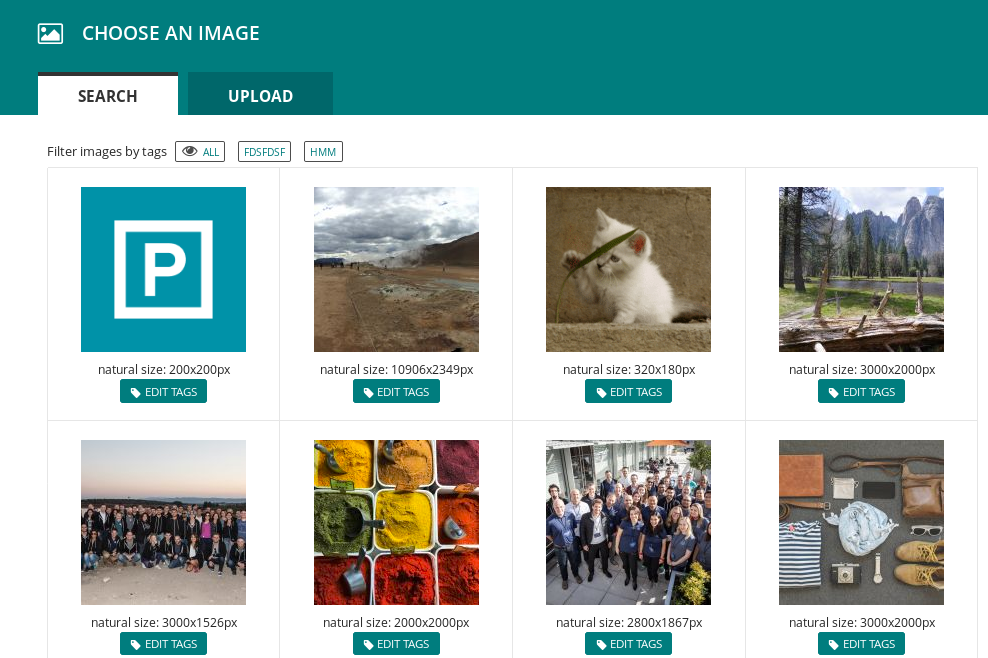

# Use cloudinary within wagtail

This project is still maintained, but I prefer this approach instead now https://gitlab.com/thelabnyc/wagtail-cloudinary-image

## About

This package adds Cloudinary support to Wagtail CMS



## Installation

`pip install wagtailcloudinary`

Wagtail 2.4 and Django 2.1 are supported.

## Configuration
Add app wagtailcloudinary in your INSTALLED_APPS list. Also add cloudinary if not already done.

```
INSTALLED_APPS = [
    ...
    'cloudinary',
    'wagtailcloudinary',
    ...
]
```

in settings.py put your cloud_name, api_key and apy_secret into cloudinary configuration

```
import cloudinary

cloudinary.config(
    cloud_name=<YOUR_CLOUDINARY_CLOUD_NAME>,
    api_key=<YOUR_CLOUDINARY_API_KEY>,
    api_secret=<YOUR_CLOUDINARY_API_SECRET>,
)
```

Next edit your urls.py like this:

```
from wagtailcloudinary import site

urlpatterns = [
    ...
    url(r'^wagtailcloudinary', include(site.urls, namespace="wagtailcloudinary")),
    ...
]
```

## Usage

in models.py

```
from wagtail.wagtailadmin.edit_handlers import FieldPanel
from wagtail.wagtailcore.models import Page
from wagtailcloudinary.fields import CloudinaryField, CloudinaryWidget

class SomePage(Page):
    image = CloudinaryField()

    content_panels = Page.content_panels + [
        FieldPanel('image', widget=CloudinaryWidget),
    ]
```

Or use in a streamfield

`from wagtailcloudinary.blocks import CloudinaryImageBlock`
